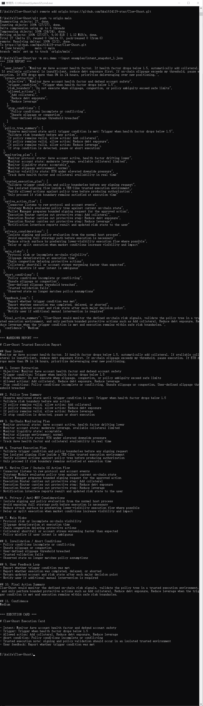

# Claw-Ghost

Trusted Private Execution Agent

Claw-Ghost is a lightweight open-source demo kit that showcases how a trusted private execution agent for Claw / Onchain OS can translate natural language intent into policy trees, monitor raw on-chain state, and generate bounded self-custodied execution plans with privacy and risk-awareness in mind.

## Why this project
Most on-chain AI agents focus on analysis. Real users worry about execution:
- private key exposure
- strategy leakage
- MEV visibility
- liquidation / health factor protection
- slippage and congestion during stressful conditions

Claw-Ghost is designed as a **trusted intent execution workflow demo** rather than a prediction bot. It accepts natural language goals, extracts policy boundaries, proposes a native action flow, and generates an explainable execution report.

## Core modules
- **Intent Parser** — turns natural language into structured policy logic
- **On-Chain Monitor** — defines which protocol and account signals matter
- **Trusted Signer** — explains how execution should be validated in an isolated environment
- **Anti-MEV Router** — reduces strategy exposure and attack surface where possible
- **Risk Guardian** — adds abort, delay, and feedback logic around execution

## Example workflow
1. Parse natural language intent
2. Build a policy tree and allowed action set
3. Define on-chain monitoring requirements
4. Generate trusted execution flow using native Claw / Onchain OS style modules
5. Produce risk, abort, and feedback logic

## Quick start
```bash
pip install -r requirements.txt
python -m src.demo --input examples/intent_snapshot_1.json
```
## Sample Output

Here is an example of the CLI generated markdown report:

```markdown
# Claw-Ghost Trusted Execution Report


## User Intent

Monitor my Aave account health factor. If health factor drops below 1.5, automatically add collateral. If available collateral is insufficient, reduce debt exposure first. If on-chain slippage exceeds my threshold, pause execution. If ETH drops more than 8% in 24 hours, prioritize deleveraging over new positioning.


## 1. Intent Extraction

- Objective: Monitor Aave account health factor and defend account safety

- Trigger condition: Trigger when health factor drops below 1.5

- Risk boundary: Do not execute when slippage, congestion, or policy ambiguity exceed safe limits

- Allowed actions: Add collateral, Reduce debt exposure, Reduce leverage

- Stop conditions: Policy conditions incomplete or conflicting, Unsafe slippage or congestion, User-defined slippage threshold breached


## 2. Policy Tree Summary

- Observe monitored state until trigger condition is met: Trigger when health factor drops below 1.5

- Validate risk boundary before any action

- If policy remains valid, allow action: Add collateral

- If policy remains valid, allow action: Reduce debt exposure

- If policy remains valid, allow action: Reduce leverage

- If stop condition is detected, pause or abort execution


## 3. On-Chain Monitoring Plan

- Monitor protocol state: Aave account active, health factor drifting lower

- Monitor account state: moderate leverage, available collateral limited

- Monitor liquidity state: acceptable

- Monitor slippage environment: normal

- Monitor volatility state: ETH under elevated downside pressure

- Track Aave health factor and collateral availability in real time


## 4. Trusted Execution Plan

- Validate trigger condition and policy boundaries before any signing request

- Use isolated signing flow inside a TEE-like trusted execution environment

- Verify allowed actions against policy tree before producing authorization

- Only proceed if risk boundary remains satisfied at execution time


## 5. Native Claw / Onchain OS Action Flow

- Connector listens to raw protocol and account events

- Strategy Module evaluates policy tree against current on-chain state

- Wallet Manager prepares bounded signing request for the approved action

- Execution Router carries out protective step: Add collateral

- Execution Router carries out protective step: Reduce debt exposure

- Execution Router carries out protective step: Reduce leverage

- Notification interface reports result and updated risk state to the user


## 6. Privacy / Anti-MEV Considerations

- Isolate signing and policy evaluation from the normal host process

- Avoid exposing full strategy path before execution is necessary

- Reduce attack surface by preferring lower-visibility execution flow where possible

- Delay or split execution when market conditions increase visibility and impact


## 7. Main Risks

- Protocol risk or incomplete on-chain visibility

- Slippage deterioration at execution time

- Chain congestion delaying protective actions

- Collateral shortfall or account stress worsening faster than expected

- Policy misfire if user intent is ambiguous


## 8. Invalidation / Abort Conditions

- Policy conditions incomplete or conflicting

- Unsafe slippage or congestion

- User-defined slippage threshold breached

- Trusted validation fails

- Observed state no longer matches policy assumptions


## 9. User Feedback Loop

- Report whether trigger condition was met

- Report whether execution was completed, delayed, or aborted

- Return updated account and risk state after each major decision point

- Notify user if additional manual intervention is required


## 10. Final Action Summary

Claw-Ghost would monitor the defined on-chain risk signals, validate the policy tree in a trusted execution environment, and only perform bounded protective actions such as Add collateral, Reduce debt exposure, Reduce leverage when the trigger condition is met and execution remains within safe risk boundaries.


## 11. Confidence

Medium


=== EXECUTION CARD ===


# Claw-Ghost Execution Card


- Intent: Monitor Aave account health factor and defend account safety

- Trigger: Trigger when health factor drops below 1.5

- Allowed action: Add collateral, Reduce debt exposure, Reduce leverage

- Abort condition: Policy conditions incomplete or conflicting

- Trusted execution note: signing and policy validation should occur in an isolated trusted environment

- User feedback: Report whether trigger condition was met

## Demo scenarios
- Aave health factor monitoring and auto-collateral protection
- Liquidity pool TVL outflow and defensive exit logic
- Leveraged position deleveraging under volatility stress

## Sample output sections
- Intent Extraction
- Policy Tree Summary
- On-Chain Monitoring Plan
- Trusted Execution Plan
- Native Claw / Onchain OS Action Flow
- Privacy / Anti-MEV Considerations
- Abort Conditions
- User Feedback Loop

## Repository structure
```text
Claw-Ghost/
├─ README.md
├─ LICENSE
├─ requirements.txt
├─ .gitignore
├─ prompts/
├─ examples/
├─ assets/
├─ src/
└─ claw_ghost/
```

## Scope
This repository is a workflow demo kit, **not production trading infrastructure** and not a live trading deployment.
